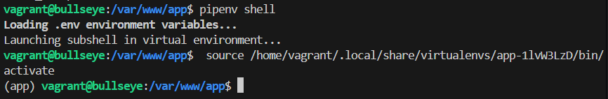

# python-con-flask

## Descripción

Este proyecto despliega una aplicación Flask utilizando Gunicorn y Nginx en una máquina virtual provisionada con Vagrant.

## Requisitos

- Vagrant
- VirtualBox

## Configuración del entorno

### 1. Clonar el repositorio

```sh
git clone <URL_DEL_REPOSITORIO>
```


### 2. Configurar Vagrant

El archivo `Vagrantfile` configura la máquina virtual con Debian Bullseye, instala las dependencias necesarias y configura Nginx y Gunicorn.

```ruby
Vagrant.configure("2") do |config|
  config.vm.box = "debian/bullseye64"
  config.vm.network "private_network", ip: "192.168.10.10"
  config.vm.network "forwarded_port", guest: 80, host: 8080

  config.vm.define "config" do |config|
    config.vm.provision "shell", inline: <<-SHELL
      sudo apt-get -y update
      sudo apt-get install -y python3-pip
      sudo mkdir -p /var/www/app
      sudo chown -R vagrant:www-data /var/www/app
      sudo chmod -R 775 /var/www/app
      sudo systemctl start nginx
      sudo systemctl status nginx
      sudo ln -s /etc/nginx/sites-available/app.conf /etc/nginx/sites-enabled/
      ls -l /etc/nginx/sites-enabled/ | grep app.conf
      sudo nginx -t
      sudo systemctl restart nginx
      sudo systemctl status nginx
    SHELL

    config.vm.provision "shell", privileged: false, inline: <<-SHELL
      pip3 install pipenv
      PATH=$PATH:/home/vagrant/.local/bin
      pip3 install python-dotenv
      cd /var/www/app
      pipenv install flask gunicorn
      sudo systemctl daemon-reload
      systemctl enable flask_app
      systemctl start flask_app
    SHELL
  end
end
```

### 3. Crear el archivo de configuración de Nginx

El archivo `app.conf` configura Nginx para servir la aplicación Flask.

```nginx
server {
  listen 80;
  server_name app.izv www.app.izv;

  access_log /var/log/nginx/app.access.log;
  error_log /var/log/nginx/app.error.log;

  location / {
    include proxy_params;
    proxy_pass http://unix:/var/www/app/app.sock;
  }
}
```


### 4. Crear el servicio de systemd para Gunicorn

El archivo `flask_app.service` configura un servicio de systemd para ejecutar Gunicorn.

```ini
[Unit]
Description=flask app service - App con Flask y Gunicorn
After=network.target

[Service]
User=vagrant
Group=www-data
Environment="PATH=/home/vagrant/.local/share/virtualenvs/app-1lvW3LzD/bin"
WorkingDirectory=/var/www/app
ExecStart=/home/vagrant/.local/share/virtualenvs/app-1lvW3LzD/bin/gunicorn --workers 3 --bind unix:/var/www/app/app.sock wsgi:app

[Install]
WantedBy=multi-user.target
```


### 5. Desplegar la aplicación


### 6. Verificar el despliegue

Accede a `http://192.168.10.10` en tu navegador para ver la aplicación desplegada.


## Archivos importantes

- `application.py`: Contiene la aplicación Flask.
- `wsgi.py`: Punto de entrada para Gunicorn.
- `app.conf`: Configuración de Nginx.
- `flask_app.service`: Configuración del servicio de systemd para Gunicorn.
- `Vagrantfile`: Configuración de Vagrant.

## Capturas de pantalla

### Clonando el repositorio


### Creando el archivo de configuración de Nginx


### Configurando el servicio de systemd para ejecutar Gunicorn


### Desplegando la aplicación en la máquina virtual


### Verificando que la aplicación se ha desplegado correctamente


### Configurando el archivo hosts para resolver el nombre de dominio


### Aplicación Flask ejecutándose con Gunicorn


### Estructura de archivos de la aplicación y el punto de entrada WSGI


### Creando un enlace simbólico para la configuración de Nginx


### Configurando el entorno virtual de Python


### Iniciando el servicio de la aplicación Flask


### Instalando Flask y Gunicorn en el entorno virtual


### Instalando los requisitos del proyecto con Pipenv


### Ruta de instalación de Gunicorn en el entorno virtual


### Configurando las variables de entorno para Pipenv



## Licencia

Este proyecto está licenciado bajo la Licencia MIT.
